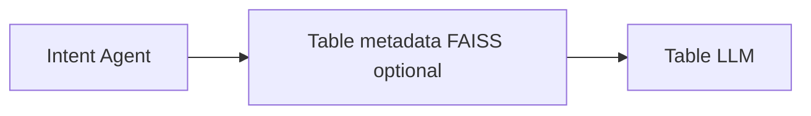
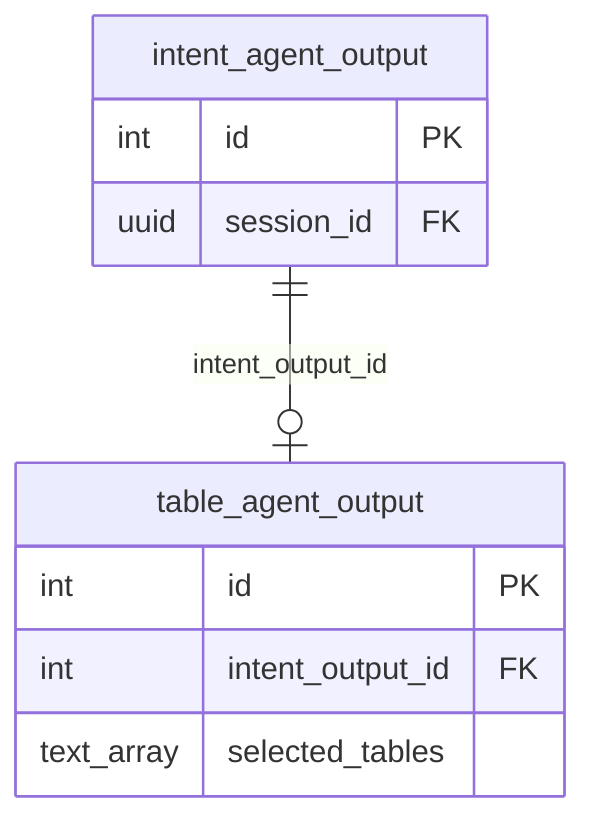

# Table Agent (5a) — Implementation Plan

Saved in-repo for step-by-step execution. (Synced from Cursor plan `table_agent_5a`.)

## Step-by-step order (do in this sequence)

| Step | What | Main files |
|------|------|------------|
| **1** | Table metadata retrieval: load `metadata_store/{schema}_metadata.json`, optional FAISS top-10 when N>10; **expose table-level only** (schema, table name, description) to the Table Agent — columns stay in JSON for index/embeddings and for a later agent | `backend/services/table_metadata_retrieval.py` |
| **2** | Table Agent: LLM prompt, JSON `selected_tables`, validate against candidates | `backend/agents/table_agent.py` |
| **3** | DB: new `app_schema.table_agent_output` (FK `intent_output_id` → `intent_agent_output.id`); `insert_intent_output` returns `id`; `insert_table_agent_output(...)` | `scripts/create_app_schema.sql`, migration SQL, `backend/api/db.py` |
| **4** | API: extend `POST /query` — after Intent, run Table Agent; persist table row; add `selected_tables` to response | `backend/api/routes/query.py` |
| **5** | Frontend: show `selected_tables` | `frontend/index.html`, `frontend/app.js` |
| **6** | (Optional) Update `docs/PROJECT_STRUCTURE.md` / setup guide | docs — **done** (structure + §7 SQL snippet include `table_agent_output`) |

**Checkpoint:** After each step you can commit and test before moving on.

---

## Context (current repo)

- **Table metadata + FAISS** from `build_vector_store.py`: indexes embed full per-table text (including columns). **Table Agent** receives only `schema_name`, `table_name`, `table_description` (no columns in prompts/candidate dicts for now).
- **Today each domain has 3 tables** → “≤10 tables → all to LLM” path. Implement “>10 → FAISS top-10 then LLM” for future growth.
- **Intent output:** `backend/agents/intent_agent.py` → `rephrased_question`, `keywords`, `business_insights`.
- **API:** `backend/api/routes/query.py` — extend so Intent + Table Agent run in **one** `POST /query` response.

---

## Design

### Inputs

- `use_case`, `rephrased_question`, `keywords`

### Candidate selection (before LLM)

1. `schema = USE_CASE_TO_SCHEMA[use_case]` (`backend/config.py`).
2. Load metadata JSON for that schema.
3. `N = len(metadata_list)`.
4. **If N ≤ 10:** candidates = all tables (table-level text: schema, name, description — no columns).
5. **If N > 10:** FAISS on `{schema}.index`, query = rephrased + keywords, top `k = min(10, N)`, map indices to metadata. Reuse embedding model `all-MiniLM-L6-v2` (shared cache with business-rules if practical).

### Table LLM

- Prompt includes rephrased question, keywords, numbered candidate table descriptions.
- Response: JSON only, e.g. `{ "selected_tables": ["schema.table_name", ...] }` — validate names against candidates.
- `chat_completion` from `backend/services/llm_client.py`.

### Output

- `run_table_agent(...) -> { "selected_tables": list[str], ... }`

### New modules

| Piece | Location |
|-------|----------|
| FAISS + metadata | `backend/services/table_metadata_retrieval.py` |
| Agent + prompt | `backend/agents/table_agent.py` |

---

## API and persistence

1. **QueryResponse:** add `selected_tables: list[str]` (and error handling policy: partial success vs fail-all — choose when implementing).
2. **Flow:** `run_intent` → `run_table_agent` with intent fields.
3. **No new columns on `intent_agent_output`.** New table **`app_schema.table_agent_output`**:
   - `id` SERIAL PK
   - `intent_output_id` INT NOT NULL REFERENCES `app_schema.intent_agent_output(id)` ON DELETE CASCADE
   - `selected_tables` TEXT[]
   - `created_at` TIMESTAMPTZ DEFAULT now()
4. **Insert:** `INSERT intent_agent_output ... RETURNING id` → `INSERT table_agent_output(intent_output_id, selected_tables)`.
5. **Reads:** join `table_agent_output` to `intent_agent_output` on `intent_output_id`.

---

## Frontend

- Display `selected_tables` in the intent output area.

## Testing

- POST /query with a retail question; expect plausible table names from metadata (e.g. `retail_schema.orders`).

## Optional

- Per-logger log level for `huggingface_hub` / `httpx` to reduce noise when loading embeddings.
