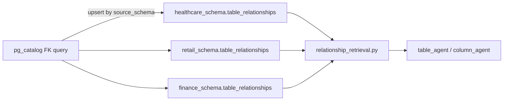

# FK relationships pipeline (per-schema architecture)

Foreign-key edges for Text2SQL agents live **inside each domain schema**, not in a central `system_schema`. Each of `healthcare_schema`, `retail_schema`, and `finance_schema` has its own **`table_relationships`** table; runtime code resolves `use_case` → `schema_name` and reads **only** that qualified table.

---

## Step 0 — Revert centralized `system_schema` (historical)

**Done.** Removed `scripts/create_system_schema_relationships.sql`, `migration_add_system_schema_table_relationships.sql`, and `run_create_system_schema_relationships.py`. If a database was migrated under the old design, rollback SQL lives in [`docs/Text2SQL_PostgreSQL_Setup_Guide.md`](Text2SQL_PostgreSQL_Setup_Guide.md) (§7b): `DROP TABLE IF EXISTS system_schema.table_relationships;` and optionally `DROP SCHEMA` only if nothing else uses `system_schema`.

---

## Step 1 — DDL per domain schema

**Done.** [`scripts/create_domain_schema_table_relationships.sql`](../scripts/create_domain_schema_table_relationships.sql) creates `{domain}.table_relationships` (no redundant `schema_name` column on rows; referencing schema is implied by the table’s schema). Companion: [`scripts/migration_add_domain_schema_table_relationships.sql`](../scripts/migration_add_domain_schema_table_relationships.sql), [`scripts/run_create_domain_schema_table_relationships.py`](../scripts/run_create_domain_schema_table_relationships.py). Setup: guide §7c. Domain list: `DOMAIN_SCHEMAS` in [`backend/config.py`](../backend/config.py).

---

## Step 2 — Extract FKs and load

**Done.** [`scripts/extract_and_load_relationships.py`](../scripts/extract_and_load_relationships.py): query `pg_catalog` for FKs whose **referencing** schema is in `DOMAIN_SCHEMAS`; upsert each row into `{source_schema}.table_relationships` (schema name from config whitelist only—never user input).

---

## Step 3 — Offline embeddings (no FAISS, no shortlist)

**Done.** [`build_relationship_embeddings.py`](../build_relationship_embeddings.py): read rows per domain table, same deterministic `ORDER BY` as Step 4, encode `relationship_text` with `all-MiniLM-L6-v2`, write `metadata_store/relationships_{schema}_metadata.json` (see `RELATIONSHIP_METADATA_NAMES` in config). **No** FAISS and **no** `top_k` at runtime in v1.

---

## Step 4 — Runtime retrieval (full list)

**Done.** [`backend/services/relationship_retrieval.py`](../backend/services/relationship_retrieval.py): `list_relationships_for_schema(schema_name)` selects from **`{schema_name}.table_relationships`** with deterministic ordering; optional helpers (e.g. filter edges to selected tables for the column agent). **Deferred:** `get_relevant_relationships(query, schema_name, top_k)` + FAISS when shortlisting is enabled.

---

## Step 5 — Wire into API and agents

**Done.** [`backend/api/routes/query.py`](../backend/api/routes/query.py): after `use_case` → `schema_name`, load relationships and pass into `run_table_agent` / `run_column_agent`. [`table_agent.py`](../backend/agents/table_agent.py) / [`column_agent.py`](../backend/agents/column_agent.py): prompts include relationship blocks (e.g. `{relationships_block}`).

---

## Step 6 — Operations and documentation

**Done.**

| Item | Location |
| --- | --- |
| **Narrative + file map** | [`docs/RELATIONSHIPS_PIPELINE.md`](RELATIONSHIPS_PIPELINE.md) — flow, key files, env vars, ops notes (no PostgreSQL `GRANT` guidance). |
| **Project structure** | [`docs/PROJECT_STRUCTURE.md`](PROJECT_STRUCTURE.md) — `RELATIONSHIPS_PIPELINE.md` in the docs tree; `config.py` line mentions `DOMAIN_SCHEMAS` / `RELATIONSHIP_METADATA_NAMES`; reference link to the pipeline doc. |
| **Setup guide** | [`docs/Text2SQL_PostgreSQL_Setup_Guide.md`](Text2SQL_PostgreSQL_Setup_Guide.md) §7c — DDL, extract/load, optional embedding build; §7b rollback for legacy `system_schema` (no grants section). |

---

## Scope (v1)

- **Embeddings:** offline/build only; rows in `{schema}.table_relationships` → `relationship_text` → JSON metadata.
- **Shortlisting:** no FAISS for relationships in v1.
- **Prompt copy:** product owner can refine Table/Column wording; implementation supplies the data path.

---

## Deliverables checklist

1. Step 0: Revert old `system_schema` artifacts + documented DB rollback.
2. Step 1: Per-domain `table_relationships` DDL + migration + runner.
3. Step 2: Extract + upsert into `{source_schema}.table_relationships`.
4. Step 3: `build_relationship_embeddings.py` + per-schema `metadata_store` JSON.
5. Step 4: `relationship_retrieval.py` (full list; deterministic order).
6. Step 5: `query.py` + agents receive relationships.
7. Step 6: Docs + ops (`PROJECT_STRUCTURE`, setup guide §7c, `RELATIONSHIPS_PIPELINE.md`).

---

## Summary

| Piece | v1 behavior |
| --- | --- |
| **Storage** | One `table_relationships` per domain schema (not one global table). |
| **Embeddings** | Build-time; `metadata_store/relationships_{schema}_metadata.json`. |
| **FAISS / top_k** | Not used for relationships in v1. |
| **Agents** | Full relationship list (and filtered edges for columns) passed in; prompts consume `relationship_text`. |

**Later:** FAISS + `get_relevant_relationships(..., top_k)` if semantic shortlisting is desired.
